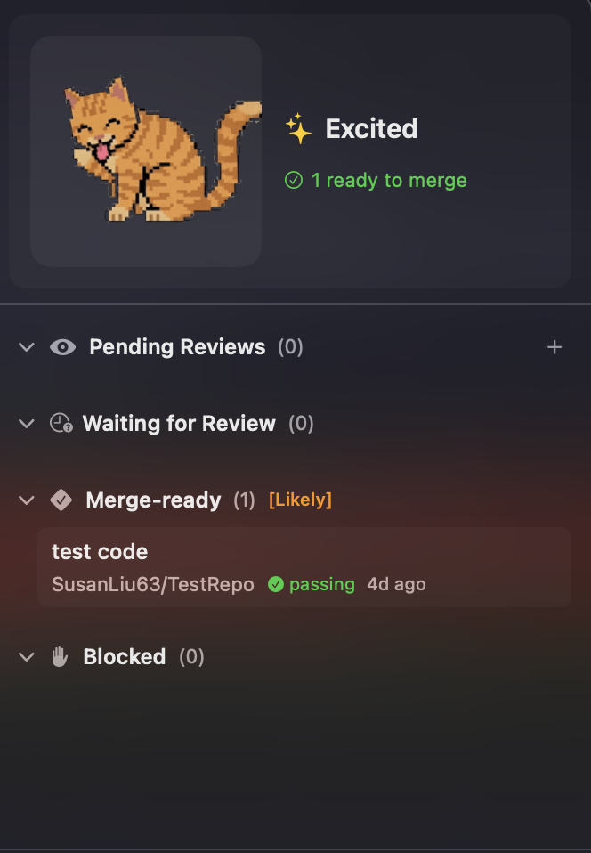

# PRNeko

A cute menu bar companion that monitors your GitHub pull requests. Your PR status, visualized as an animated cat.


## Features

- **Menu bar app** - Lives in your menu bar, not the dock
- **PR monitoring** - Tracks PRs you authored and PRs awaiting your review
- **Animated cat** - Shows different moods based on your PR status:
  - Idle/relaxed when everything is good
  - Anxious when PRs are blocked
  - Excited when PRs are ready to merge
  - Hungry when reviews are waiting for you
- **GitHub OAuth** - Secure device flow authentication
- **Auto-refresh** - Polls GitHub every 3 minutes

## Screenshot


## Run

```bash
swift build && .build/arm64-apple-macosx/debug/PRNeko
```

Click the paw icon in your menu bar and log in with GitHub.

## Requirements

- macOS 13.0+
- GitHub account

## License

MIT
