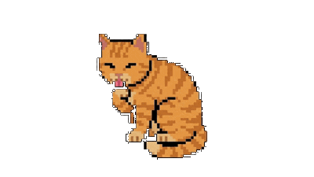

<p align="center">
  
</p>

<h1 align="center">PRNeko</h1>

<p align="center">
  <strong>Your PR status, visualized as an adorable animated cat.</strong>
</p>

<p align="center">
  
  
  
</p>

<p align="center">
  
</p>

---

## Why PRNeko?

Ever forget about a PR that's ready to merge? Or miss a review request buried in your notifications?

**PRNeko** lives in your menu bar and keeps you informed with a glance. No more context switching to GitHub — just look at your cat:

| Mood | Meaning |
|------|---------|
| **Idle** | All clear! Nothing needs attention |
| **Excited** | PRs are approved and ready to merge |
| **Hungry** | Someone's waiting for your review |
| **Anxious** | PRs are blocked by failing checks |

## Features

- **Zero friction** — Lives quietly in your menu bar
- **Smart categorization** — PRs organized by what needs your attention
- **Secure auth** — GitHub OAuth device flow (no tokens in config files)
- **Auto-refresh** — Polls every 3 minutes so you're always up to date

## Quick Start

```bash
swift build && .build/arm64-apple-macosx/debug/PRNeko
```

Click the paw in your menu bar → Log in with GitHub → Done!

## Requirements

- macOS 13.0+
- GitHub account

## License

MIT
